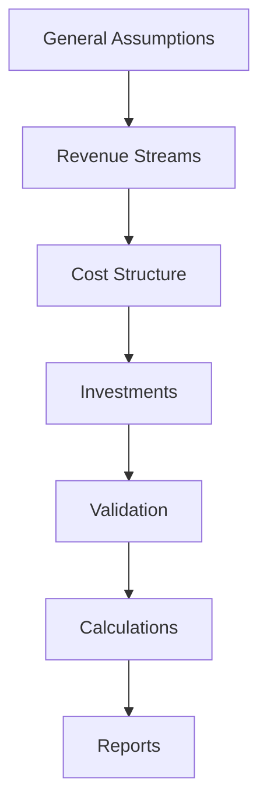
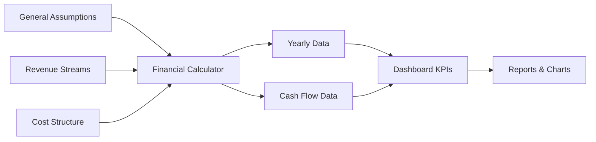

# Financial Planning Components Documentation

## Table of Contents

1. [Overview](#overview)
2. [Financial Planning Workflow](#financial-planning-workflow)
3. [Core Financial Components](#core-financial-components)
4. [Revenue Management Components](#revenue-management-components)
5. [Cost Management Components](#cost-management-components)
6. [Analysis Components](#analysis-components)
7. [Reporting Components](#reporting-components)
8. [Calculation Functions](#calculation-functions)
9. [Data Flow](#data-flow)
10. [Best Practices](#best-practices)

## Overview

The Financial Planning Application provides a comprehensive suite of components for creating, managing, and analyzing financial projections. This documentation covers the specific financial planning components and their business logic.

## Financial Planning Workflow

### 1. Plan Setup Phase



### 2. Data Dependencies

- **General Assumptions** → Foundation for all calculations
- **Revenue Streams** → Income projections
- **Cost Structure** → Expense projections
- **Investments** → Capital expenditure and amortization
- **Financial Calculations** → Automated computation
- **Reports & Analysis** → Results presentation

## Core Financial Components

### `GeneralAssumptions`

The foundation component for all financial planning assumptions.

```typescript
interface GeneralAssumptionsProps {
  data: GeneralAssumptions;
  onChange: (data: GeneralAssumptions) => void;
}

// Key fields managed:
- companyName: string
- timeHorizon: number (1-10 years)
- startDate: string (format: "mon-yyyy")
- inflationRate: number (0-20%)
- taxRates: { iresRate: number, irapRate: number }
- loanDetails: { amount: number, interestRate: number, duration: number }
- businessMetrics: { churnRate: number, collectionDays: number }
```

**Usage Example:**
```typescript
import { GeneralAssumptions } from '@/components/FinancialPlan/GeneralAssumptions';

function PlanSetup() {
  const { planData, setGeneral } = usePlanData();
  
  return (
    <GeneralAssumptions
      data={planData.general}
      onChange={setGeneral}
    />
  );
}
```

**Key Features:**
- Automated validation of input ranges
- Currency selection with proper formatting
- Date picker with month-year selection
- Real-time impact preview
- Help tooltips for complex fields

### `ExecutiveDashboard`

High-level KPI dashboard showing key financial metrics.

```typescript
interface ExecutiveDashboardProps {
  planData: FinancialPlanState;
}

// Key metrics displayed:
- Peak Funding Requirement
- Enterprise Value
- IRR (Internal Rate of Return)
- Payback Period
- Break-even Analysis
- Unit Economics (LTV, CAC, LTV:CAC)
```

**Features:**
- Real-time metric calculations
- Visual KPI cards with trend indicators
- Interactive charts with drill-down capability
- Automated insights generation
- Export functionality

## Revenue Management Components

### `RecoverableClients`

Manages revenue from existing client relationships that can be recovered.

```typescript
interface RecoverableClientsProps {
  data: RecoverableClient[];
  onChange: (data: RecoverableClient[]) => void;
}

// Revenue calculation factors:
- previousAnnualRevenue: Historical revenue baseline
- recoveryProbability: Percentage chance of recovery (0-100%)
- recoveryAmountPercentage: Percentage of historical revenue recoverable
- serviceType: 'ricorrente' | 'una_tantum'
- contractDurationMonths: Length of service contracts
- renewalProbability: Chance of contract renewal
- activationRampUpMonths: Gradual revenue increase period
```

**Business Logic:**
```typescript
// Recurring revenue calculation
const monthlyRevenue = (previousAnnualRevenue * recoveryAmountPercentage / 100 * recoveryProbability / 100) / 12;

// One-time revenue calculation
const oneTimeRevenue = previousAnnualRevenue * recoveryAmountPercentage / 100 * recoveryProbability / 100;

// Revenue with ramp-up period
if (monthInContract <= activationRampUpMonths) {
  revenue *= (monthInContract / activationRampUpMonths);
}
```

### `NewClients`

Manages acquisition of new clients through marketing channels.

```typescript
interface NewClientAcquisitionProps {
  data: NewClientAcquisition[];
  onChange: (data: NewClientAcquisition[]) => void;
}

// Acquisition metrics:
- channel: Marketing channel name
- monthlyMarketingInvestment: Monthly spend
- leadsPer100Invested: Lead generation efficiency
- conversionRate: Lead to customer conversion %
- averageAnnualContractValue: Revenue per customer
- startMonth: When acquisition begins
```

**Customer Acquisition Calculation:**
```typescript
const monthlyLeads = (monthlyMarketingInvestment / 100) * leadsPer100Invested;
const newCustomers = monthlyLeads * (conversionRate / 100);
const monthlyRevenue = newCustomers * (averageAnnualContractValue / 12);

// Growth factor applied
const effectiveInvestment = monthlyMarketingInvestment * Math.pow(1 + growthRate / 100, year - 1);
```

### `DirectlyAcquiredClients`

Manages revenue from directly acquired clients (no marketing cost).

```typescript
interface DirectlyAcquiredClientsProps {
  data: DirectlyAcquiredClient[];
  onChange: (data: DirectlyAcquiredClient[]) => void;
}

// Direct acquisition parameters:
- numberOfClients: Fixed number of clients
- serviceType: 'ricorrente' | 'una_tantum'
- annualContractValue: Yearly revenue per client
- monthlyContractValue: Monthly revenue per client
- startMonth: Revenue start date
```

## Cost Management Components

### `PersonnelCosts`

Comprehensive personnel cost management with multiple contract types.

```typescript
interface PersonnelCostsProps {
  data: PersonnelCost[];
  onChange: (data: PersonnelCost[]) => void;
}

// Contract types supported:
1. Employee ('Dipendente')
   - monthlyNetSalary + RAL coefficient
   - OR annualGrossSalary + company cost coefficient
   - Annual salary increases
   - Performance bonuses (EBITDA %, Net Profit %, Fixed Amount)

2. Freelance/VAT ('Freelance/P.IVA')
   - Fixed monthly cost
   - No additional taxes or benefits

3. Administrator Compensation ('Compenso Amministratore')
   - Fixed monthly compensation
   - Subject to different tax treatment
```

**Cost Calculation Logic:**
```typescript
// Employee cost calculation
const currentRAL = annualGrossSalary * Math.pow(1 + annualSalaryIncrease / 100, year - 1);
const totalCost = currentRAL * companyCostCoefficient;

// Bonus calculation
let bonusAmount = 0;
if (bonusType === '% su EBITDA') {
  bonusAmount = previousYear.ebitda * (bonusValue / 100);
} else if (bonusType === '% su Utile Netto') {
  bonusAmount = previousYear.netProfit * (bonusValue / 100);
} else if (bonusType === 'Importo Fisso Annuo') {
  bonusAmount = bonusValue;
}
```

### `FixedCosts`

Management of fixed operational costs with inflation indexing.

```typescript
interface FixedCostsProps {
  data: FixedCost[];
  onChange: (data: FixedCost[]) => void;
}

// Fixed cost features:
- monthlyCost: Base monthly expense
- indexedToInflation: Boolean flag for inflation adjustment
- paymentFrequency: 'Mensile' | 'Trimestrale' | 'Semestrale' | 'Annuale'
- subItems: Breakdown of cost components
- startMonth: When cost begins
```

**Inflation Adjustment:**
```typescript
const inflationFactor = Math.pow(1 + inflationRate / 100, year - 1);
const adjustedCost = baseCost * (indexedToInflation ? inflationFactor : 1);
```

### `VariableCosts`

Management of costs that vary with revenue or contract volume.

```typescript
interface VariableCostsProps {
  data: VariableCost[];
  onChange: (data: VariableCost[]) => void;
}

// Calculation methods:
1. '% su Ricavi Totali' - Percentage of total revenue
2. '% su Ricavi Specifici' - Percentage of specific revenue stream
3. '€ per Contratto' - Fixed amount per contract/customer
```

**Variable Cost Calculation:**
```typescript
switch(calculationMethod) {
  case '% su Ricavi Totali':
    cost = (percentage / 100) * totalRevenue;
    break;
  case '% su Ricavi Specifici':
    const specificRevenue = getRevenueByChannel(linkedChannel);
    cost = (percentage / 100) * specificRevenue;
    break;
  case '€ per Contratto':
    cost = amountPerContract * totalContracts;
    break;
}
```

### `Investments`

Capital expenditure management with amortization calculations.

```typescript
interface InvestmentsProps {
  data: InitialInvestment[];
  onChange: (data: InitialInvestment[]) => void;
}

// Investment parameters:
- cost: Total investment amount
- investmentMonth: When investment is made
- amortizationYears: Depreciation period
- paymentMethod: 'Unica Soluzione' | 'Rateizzato'
- installments: Number of payments if installment
- subItems: Investment breakdown
```

**Amortization Logic:**
```typescript
const investmentStartYear = Math.ceil(investmentMonth / 12);
const amortizationEndYear = investmentStartYear + amortizationYears - 1;

if (currentYear >= investmentStartYear && currentYear <= amortizationEndYear) {
  const annualAmortization = totalCost / amortizationYears;
  return annualAmortization;
}
```

## Analysis Components

### `SensitivityAnalysisSetup`

Configuration interface for sensitivity analysis parameters.

```typescript
interface SensitivityAnalysisSetupProps {
  onAnalysisRun: (config: SensitivityConfig) => void;
}

// Configurable parameters:
- variableToAnalyze: Key assumption to vary
- minValue: Minimum value for analysis
- maxValue: Maximum value for analysis
- steps: Number of analysis points
- targetMetric: KPI to measure impact on
```

### `SensitivityAnalysisResults`

Displays results of sensitivity analysis with visualization.

```typescript
interface SensitivityAnalysisResultsProps {
  results: SensitivityResult[];
  baseScenario: FinancialPlanState;
}

// Results include:
- variableValue: Input parameter value
- impactMetrics: Calculated KPIs for each scenario
- percentageChange: Change from base scenario
- chartData: Formatted for visualization
```

## Reporting Components

### `IncomeStatement`

Displays comprehensive profit & loss projections.

```typescript
interface IncomeStatementProps {
  data: YearlyData[];
}

// Financial statement structure:
Revenue Section:
- Recoverable Client Revenue
- New Client Revenue  
- Directly Acquired Client Revenue
- Total Revenue

Cost Section:
- Personnel Costs
- Fixed Costs
- Variable Costs
- Marketing Costs
- Total Costs

Profitability:
- EBITDA (Earnings Before Interest, Taxes, Depreciation, Amortization)
- Amortization
- EBIT (Earnings Before Interest and Taxes)
- Interest Expense
- EBT (Earnings Before Taxes)
- Taxes (IRES + IRAP)
- Net Profit

Margins:
- Contribution Margin %
- EBITDA Margin %
- EBIT Margin %
- Net Profit Margin %
```

### `CashFlowStatement`

Cash flow analysis with working capital management.

```typescript
interface CashFlowStatementProps {
  data: CashFlowYearlyData[];
}

// Cash flow components:
Operating Activities:
- Net Profit
- Add: Amortization
- Gross Operating Cash Flow
- Change in Working Capital
  - Change in Receivables
  - Change in Payables
- Net Operating Cash Flow

Investing Activities:
- Capital Expenditures (CAPEX)
- Net Investing Cash Flow

Financing Activities:
- Equity Injection
- Loan Proceeds
- Loan Principal Repayment
- Dividends Paid
- Net Financing Cash Flow

Cash Position:
- Starting Cash
- Net Cash Flow
- Ending Cash
- Minimum Cash Buffer Check
```

**Working Capital Calculation:**
```typescript
// Receivables calculation
const receivables = (revenue * weightedAverageCollectionDays) / 365;

// Payables calculation  
const payables = (totalCosts * daysToPayPayables) / 365;

// Working capital change
const changeInWorkingCapital = (currentReceivables - previousReceivables) - 
                              (currentPayables - previousPayables);
```

## Calculation Functions

### Financial Calculator

```typescript
// Main calculation engine
function calculateFinancialSummary(plan: FinancialPlanState): YearlyData[]

// Key calculation steps:
1. Revenue Projections
   - Process each revenue stream
   - Apply growth rates and timing
   - Handle recurring vs one-time revenue
   - Account for churn and renewals

2. Cost Calculations
   - Personnel cost evolution
   - Fixed cost inflation adjustments
   - Variable cost scaling
   - Marketing investment tracking

3. Financial Metrics
   - EBITDA = Revenue - Operating Costs
   - EBIT = EBITDA - Amortization
   - EBT = EBIT - Interest Expense
   - Net Profit = EBT - Taxes
   - Margins = Metrics / Revenue * 100
```

### Dashboard Calculator

```typescript
// Advanced KPI calculations
function calculateDashboardData(plan: FinancialPlanState): DashboardData

// KPI calculations:
1. Peak Funding Requirement
   - Track cumulative cash flow
   - Identify maximum cash deficit
   - Account for minimum cash buffer

2. Enterprise Value
   - Terminal value calculation
   - DCF analysis with WACC
   - Multiple-based valuation

3. IRR Calculation
   - Cash flow NPV analysis
   - Iterative IRR solving
   - Payback period determination

4. Unit Economics
   - LTV = Average Revenue * Margin / Churn Rate
   - CAC = Marketing Investment / New Customers
   - LTV:CAC ratio analysis
```

### Cash Flow Calculator

```typescript
// Monthly cash flow projections
function calculateCashFlow(plan: FinancialPlanState, financialSummary: YearlyData[]): CashFlowYearlyData[]

// Working capital management:
1. Receivables Management
   - Days to collect calculation
   - Weighted average by revenue stream
   - Impact on cash conversion

2. Payables Management
   - Payment timing optimization
   - Cash flow smoothing
   - Supplier relationship impact
```

## Data Flow

### State Management Flow

```typescript
// Central state management
usePlanData() Hook
├── localStorage persistence
├── State validation
├── Change propagation
└── Real-time calculations

// Component update pattern
1. User Input → Component State
2. Component State → Global State (usePlanData)
3. Global State → localStorage
4. Global State → Calculation Engines
5. Calculated Results → Display Components
```

### Calculation Dependencies



## Best Practices

### Component Design

1. **Separation of Concerns**
   - Input components handle data entry
   - Calculation functions handle business logic
   - Display components handle presentation

2. **Data Validation**
   - Client-side validation with Zod schemas
   - Real-time feedback on invalid inputs
   - Business rule enforcement

3. **Performance Optimization**
   - Memoized calculations
   - Debounced input updates
   - Efficient re-rendering

### Financial Modeling

1. **Assumption Management**
   - Conservative vs optimistic scenarios
   - Sensitivity analysis on key variables
   - Documentation of assumptions

2. **Validation Checks**
   - Cash flow feasibility
   - Market size constraints
   - Operational capacity limits

3. **Scenario Planning**
   - Base, optimistic, pessimistic cases
   - Monte Carlo analysis capability
   - Stress testing scenarios

### Error Handling

1. **Input Validation**
```typescript
// Example validation schema
const GeneralAssumptionsSchema = z.object({
  companyName: z.string().min(1, "Company name required"),
  timeHorizon: z.number().min(1).max(10),
  inflationRate: z.number().min(0).max(0.2),
  // ... other validations
});
```

2. **Calculation Safeguards**
```typescript
// Safe division with fallback
const margin = revenue > 0 ? (profit / revenue) * 100 : 0;

// Boundary checks
const adjustedValue = Math.max(0, Math.min(maxValue, inputValue));
```

3. **User Feedback**
```typescript
// Error state management
if (calculationError) {
  return (
    <Alert variant="destructive">
      <AlertCircle className="h-4 w-4" />
      <AlertTitle>Calculation Error</AlertTitle>
      <AlertDescription>
        Unable to process financial projections. Please check your inputs.
      </AlertDescription>
    </Alert>
  );
}
```

### Testing Recommendations

1. **Unit Testing**
   - Test calculation functions with known inputs
   - Validate boundary conditions
   - Check error handling

2. **Integration Testing**
   - Test component interactions
   - Validate data flow
   - Check state management

3. **Financial Validation**
   - Compare with external models
   - Validate against industry benchmarks
   - Cross-check calculations manually